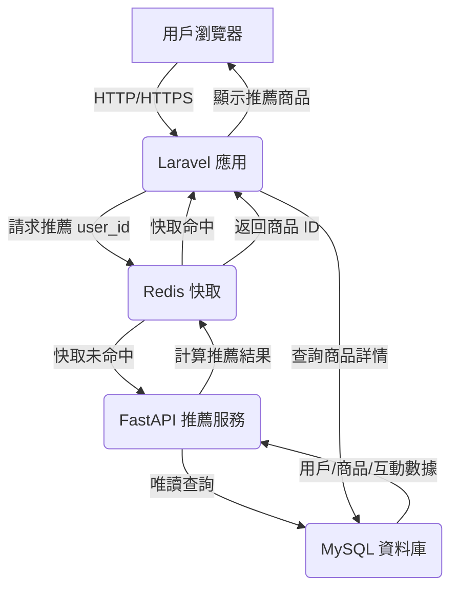

# 🚀 Laravel x FastAPI 推薦系統：跨語言微服務架構

## 💡 專案簡介

本專案展示了一個現代化的**跨語言微服務架構**，結合 **Laravel 10**（PHP）與 **FastAPI**（Python），模擬電商平台的商品推薦功能。Laravel 負責核心業務邏輯（用戶管理、商品展示、訂單處理），FastAPI 則專注於高效能的推薦演算法，通過**唯讀權限**直接連接到 Laravel 的 MySQL 資料庫，無需額外資料同步。**Redis** 作為高效快取和跨服務溝通橋樑，確保速度與穩定性。專案採用 **Docker** 容器化部署，並透過 **GitHub Actions** 實現自動化 CI/CD，強調**高效能、可擴展、易維護**的設計理念。

**[查看專案原始碼](https://github.com/BpsEason/laravel-fastapi-recommender.git)**

## 🎯 專案目標

- **跨語言通訊**：利用 Redis 實現 Laravel 與 FastAPI 的無縫數據交換。
- **高效能推薦**：FastAPI 執行協同過濾演算法，結果快取至 Redis。
- **微服務架構**：Laravel 處理業務邏輯，FastAPI 專注推薦，職責分明。
- **自動化流程**：透過 GitHub Actions 實現測試與部署自動化。
- **容器化部署**：使用 Docker Compose 確保環境一致性。

## 🏛️ 技術架構圖



**流程說明**：
1. 用戶訪問 Laravel 前台（`http://localhost:8000`），觸發商品推薦需求。
2. Laravel 透過 `RecommendationService` 查詢 Redis 快取（Key: `user:{user_id}:recommendations`）。
3. 若快取命中，直接從 MySQL 查詢商品詳情並渲染。
4. 若快取未命中，Laravel 呼叫 FastAPI 的 `/api/v1/recommendations/{user_id}`。
5. FastAPI 從 MySQL 讀取數據，計算推薦，結果存入 Redis（TTL: 3600 秒）。
6. Laravel 從 Redis 獲取結果，渲染至 `product_detail.blade.php`。

## 📂 專案結構

```
├── laravel-app/                           # Laravel 業務邏輯
│   ├── app/
│   │   ├── Http/Controllers/ProductController.php
│   │   ├── Services/
│   │   │   ├── API/RecommenderClient.php  # FastAPI API 客戶端
│   │   │   └── RecommendationService.php  # 推薦邏輯
│   │   └── Models/Eloquent/               # Eloquent 模型
│   ├── resources/views/product_detail.blade.php
│   ├── routes/web.php
│   └── Dockerfile
├── recommender-service/                   # FastAPI 推薦服務
│   ├── app/
│   │   ├── api/v1/routes.py              # API 路由
│   │   ├── core/config.py                # 環境設定
│   │   ├── data/data_loader.py           # 資料載入
│   │   ├── services/recommender_logic.py # 推薦演算法
│   │   └── models/                       # SQLAlchemy 模型
│   ├── tests/test_routes.py              # 測試
│   ├── Dockerfile
│   └── requirements.txt
├── redis/                                 # Redis 設定
│   ├── redis.conf
│   └── init-redis-data.sh
├── .github/workflows/deploy.yml           # CI/CD 流程
├── docker-compose.yml                     # Docker 設定
└── README.md
```

## 🛠️ 技術棧

- **後端框架**：Laravel 10 (PHP)、FastAPI (Python)
- **資料庫與快取**：MySQL 8.0、Redis
- **資料處理**：SQLAlchemy、Pandas、NumPy、scikit-learn（協同過濾）
- **容器化**：Docker、Docker Compose
- **CI/CD**：GitHub Actions
- **測試**：PHPUnit (Laravel)、Pytest (FastAPI)

## 🚀 快速上手

### 前置條件
- Docker Desktop
- Git

### 啟動步驟

1. **克隆專案**
   ```bash
   git clone https://github.com/BpsEason/laravel-fastapi-recommender.git
   cd laravel-fastapi-recommender
   ```

2. **啟動服務**
   ```bash
   docker-compose up --build -d
   ```

3. **設定 Laravel**
   ```bash
   docker-compose exec laravel-app composer install
   docker-compose exec laravel-app php artisan key:generate
   docker-compose exec laravel-app php artisan migrate --force
   docker-compose exec laravel-app php artisan db:seed
   ```

4. **訪問應用**
   - **Laravel 前台**：http://localhost:8000
   - **FastAPI Swagger UI**：http://localhost:8001/docs
   - **模擬登入**：http://localhost:8000/simulate-login/1（用戶 ID 1）

## 🧪 關鍵代碼展示

### 1. Laravel：產品展示與互動記錄
以下是 `ProductController.php` 中處理商品展示與用戶互動的核心邏輯：

```php
// app/Http/Controllers/ProductController.php
public function show(Request $request, $id)
{
    $product = Product::with('category')->findOrFail($id);
    $recommendedProducts = collect();

    if (Auth::check()) {
        $user = Auth::user();
        // 記錄用戶互動
        UserInteraction::create([
            'user_id' => $user->id,
            'product_id' => $product->id,
            'interaction_type' => 'view',
        ]);
        Log::info("User interaction logged: user {$user->id} viewed product {$product->id}.");

        // 獲取推薦並排除當前商品
        $recommendedProducts = $this->recommendationService->getRecommendations($user->id)
            ->filter(fn($item) => $item->id !== $product->id);
    } else {
        // 訪客冷啟動：推薦熱門商品
        $recommendedProducts = $this->recommendationService->getPopularProducts(5)
            ->filter(fn($item) => $item->id !== $product->id);
    }

    return view('product_detail', compact('product', 'recommendedProducts'));
}
```

**注解**：
- 檢查用戶是否登入，若登入則記錄瀏覽互動至 `user_interactions` 表。
- 使用 `RecommendationService` 獲取推薦，過濾掉當前商品以避免重複。
- 非登入用戶回退至熱門商品，實現冷啟動。

### 2. Laravel：推薦服務邏輯
`RecommendationService.php` 負責快取與 FastAPI 的交互：

```php
// app/Services/RecommendationService.php
public function getRecommendations(int $userId, int $numRecommendations = 5): Collection
{
    $cacheKey = "user:{$userId}:recommendations";
    $fallbackCacheKey = "user:{$userId}:recommendations_fallback";

    // 優先從 Redis 獲取快取
    try {
        $cachedProductIdsJson = $this->redis->get($cacheKey);
        if ($cachedProductIdsJson) {
            Log::info("Fetched recommendations for user {$userId} from Redis cache.");
            $recommendedProductIds = json_decode($cachedProductIdsJson, true);
            return Product::whereIn('id', $recommendedProductIds)->get();
        }
    } catch (\Exception $e) {
        Log::error("Redis error: {$e->getMessage()}. Falling back to file cache.");
        // Redis 故障時使用檔案快取
        if ($fallbackProductIds = Cache::get($fallbackCacheKey)) {
            return Product::whereIn('id', $fallbackProductIds)->get();
        }
    }

    // 快取未命中，呼叫 FastAPI
    $directRecommendations = $this->recommenderClient->getDirectRecommendations($userId, $numRecommendations);
    if ($directRecommendations) {
        Cache::put($fallbackCacheKey, $directRecommendations, now()->addMinutes(10));
        return Product::whereIn('id', $directRecommendations)->get();
    }

    // 最終回退至熱門商品
    return $this->getPopularProducts($numRecommendations);
}
```

**注解**：
- 優先從 Redis 讀取快取，Key 格式為 `user:{user_id}:recommendations`。
- Redis 故障時，使用 Laravel 的檔案快取作為備案。
- 若快取均未命中，通過 `RecommenderClient` 呼叫 FastAPI，結果存入快取。
- 所有途徑失敗時，回退至熱門商品，確保系統穩定。

### 3. FastAPI：推薦演算法
`recommender_logic.py` 實現協同過濾推薦：

```python
# recommender-service/app/services/recommender_logic.py
def recommend_for_user(self, target_user_id: int, num_recommendations: int = 5) -> List[int]:
    interaction_matrix, all_user_ids, all_product_ids = self.get_interaction_matrix_and_mappings()

    # 冷啟動處理
    if not all_user_ids or target_user_id not in all_user_ids:
        logger.info(f"User {target_user_id} not in data. Falling back to popular products.")
        return self.get_popular_products(num_recommendations)

    target_user_idx = all_user_ids.index(target_user_id)
    user_similarity = self.calculate_similarity(interaction_matrix)

    # 計算相似用戶的推薦分數
    similar_users_indices = user_similarity[target_user_idx].argsort()[::-1][1:]
    recommended_scores: Dict[int, float] = {}
    user_interacted_product_ids = {all_product_ids[i] for i in np.where(interaction_matrix[target_user_idx] > 0)[0]}

    for sim_user_idx in similar_users_indices:
        similarity_score = user_similarity[target_user_idx, sim_user_idx]
        if similarity_score <= 0.0:
            continue
        for product_idx in np.where(interaction_matrix[sim_user_idx] > 0)[0]:
            product_id = all_product_ids[product_idx]
            if product_id in user_interacted_product_ids:
                continue
            recommended_scores[product_id] = recommended_scores.get(product_id, 0.0) + \
                interaction_matrix[sim_user_idx, product_idx] * similarity_score

    sorted_recommendations = sorted(recommended_scores.items(), key=lambda item: item[1], reverse=True)
    return [product_id for product_id, _ in sorted_recommendations[:num_recommendations]] or \
           self.get_popular_products(num_recommendations)
```

**注解**：
- 從資料庫載入互動數據，構建用戶-商品互動矩陣。
- 使用 scikit-learn 的餘弦相似度計算用戶間相似性。
- 為目標用戶計算推薦分數，排除已互動商品。
- 無數據時回退至熱門商品，確保冷啟動場景的可用性。

### 4. FastAPI：API 端點
`routes.py` 定義推薦 API：

```python
# recommender-service/app/api/v1/routes.py
@router.get("/recommendations/{user_id}", response_model=List[int])
async def get_recommendations_for_user(
    user_id: int,
    num_recommendations: int = 5,
    db: Depends(get_db),
    redis_client: Depends(get_redis_client)
):
    logger.info(f"Received recommendation request for user_id: {user_id}")
    redis_key = f"user:{user_id}:recommendations"

    # 檢查用戶是否存在
    user_exists = db.query(User).filter(User.id == user_id).first()
    if not user_exists:
        raise HTTPException(status_code=404, detail=f"User with ID {user_id} not found.")

    # 檢查 Redis 快取
    try:
        cached_recommendations = redis_client.get(redis_key)
        if cached_recommendations:
            logger.info(f"Returning cached recommendations for user {user_id}")
            return json.loads(cached_recommendations)
    except Exception as e:
        logger.error(f"Error accessing Redis: {e}")

    # 計算推薦並快取
    recommender = Recommender(db)
    recommended_product_ids = recommender.recommend_for_user(user_id, num_recommendations)
    try:
        redis_client.setex(redis_key, 3600, json.dumps(recommended_product_ids))
        logger.info(f"Recommendations for user {user_id} cached in Redis.")
    except Exception as e:
        logger.error(f"Error caching recommendations: {e}")

    return recommended_product_ids
```

**注解**：
- 提供 GET 端點 `/api/v1/recommendations/{user_id}`，返回商品 ID 列表。
- 優先從 Redis 獲取快取，減少計算負載。
- 若快取未命中，調用 `Recommender` 計算並存入 Redis，TTL 為 1 小時。
- 包含錯誤處理，確保 API 穩定性。

## 🧪 測試執行

- **Laravel 測試**：
  ```bash
  docker-compose exec laravel-app php artisan test
  ```

- **FastAPI 測試**：
  ```bash
  docker-compose exec recommender-service pytest
  ```

## 🌐 CI/CD 流程

透過 GitHub Actions（`.github/workflows/deploy.yml`），推送至 `main` 分支時自動執行：
- **Laravel**：安裝依賴、運行 PHPUnit 測試、檢查路由與遷移。
- **FastAPI**：安裝依賴、運行 Pytest 測試。

## 📦 Redis 快取設計

- **Key**：`user:{user_id}:recommendations`（如 `user:1:recommendations`）
- **Value**：JSON 化的商品 ID 列表，如 `[101, 102, 103]`
- **TTL**：3600 秒（1 小時）

## ✨ 專案亮點

- **跨語言協作**：Laravel 與 FastAPI 透過 Redis 無縫銜接，展現異質系統整合能力。
- **資料一致性**：FastAPI 唯讀連線 Laravel 的 MySQL，無需額外同步，確保即時性。
- **容錯設計**：Redis 故障時，Laravel 回退至檔案快取或熱門商品，系統穩定。
- **模組化架構**：分層設計（控制器、服務、模型），程式碼清晰，易於維護。
- **冷啟動解決方案**：新用戶或無數據時，提供熱門商品推薦。
- **可擴展性**：演算法採用策略模式，未來可輕鬆切換至深度學習模型。

## 🔁 未來計劃

- **非同步處理**：引入 Kafka 或 Redis Stream，實現背景推薦計算。
- **混合推薦**：結合協同過濾與基於內容的推薦，提升精準度。
- **監控系統**：整合 Prometheus 和 Grafana，監測服務效能與快取命中率。
- **同類別推薦**：基於商品類別推播熱門商品，優化冷啟動體驗。
