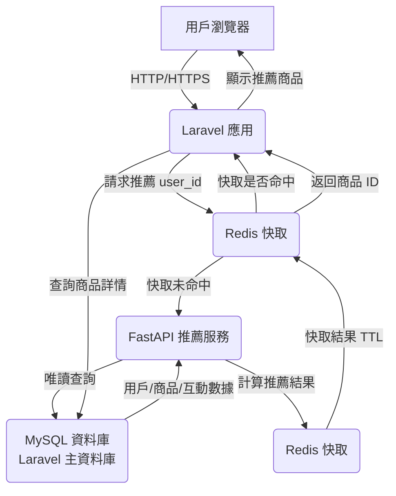

# 🚀 Laravel x FastAPI 推薦系統：跨語言微服務架構

## 💡 專案簡介

這專案搞了一個跨語言的微服務架構，用 **Laravel 10**（PHP）跟 **FastAPI**（Python）搭在一起，模擬電商平台的商品推薦功能。Laravel 負責核心業務邏輯，像用戶管理、商品展示、訂單處理；FastAPI 則專心跑高效能的推薦演算法，直接用**唯讀權限**連到 Laravel 的 MySQL 資料庫抓數據，不用另外搞什麼資料同步。**Redis** 當快取跟跨服務的溝通橋樑，速度快又穩定。整個專案用 **Docker** 包好，部署超方便，還用 **GitHub Actions** 弄了自動化 CI/CD，重點是可擴展、好維護、環境一致。

**[查看專案原始碼](https://github.com/BpsEason/laravel-fastapi-recommender.git)**

## 🎯 專案目標

- 用 Redis 讓 Laravel 跟 FastAPI 順暢溝通，跨語言沒問題。
- 搞一個高效能的推薦系統，FastAPI 用協同過濾算推薦，結果丟 Redis 快取。
- 微服務架構，Laravel 管業務，FastAPI 管推薦，各司其職。
- 用 GitHub Actions 自動跑測試跟部署，省麻煩。
- Docker 容器化，環境設定一次搞定。

## 🏛️ 技術架構圖



**流程說明**：
1. 用戶用瀏覽器連到 Laravel（`http://localhost:8000`），要看商品推薦。
2. Laravel 透過 `RecommendationService` 去 Redis 查用戶的推薦快取（Key: `user:{user_id}:recommendations`）。
3. 如果 Redis 有快取，就直接拿商品 ID，去 MySQL 查詳情後秀出來。
4. 如果 Redis 沒東西，Laravel 就呼叫 FastAPI 的 `/api/v1/recommendations/{user_id}`。
5. FastAPI 用唯讀權限從 MySQL 抓用戶、商品、互動數據（`user_interactions` 跟 `order_items` 表）。
6. FastAPI 用協同過濾算推薦（`recommender_logic.py`），結果存回 Redis（TTL 3600 秒）。
7. Laravel 再從 Redis 拿結果，查 MySQL 後渲染到 `product_detail.blade.php`。

## 📂 專案結構

```
laravel-fastapi-recommender/
├── laravel-app/                            # Laravel 專案
│   ├── app/
│   │   ├── Http/Controllers/ProductController.php
│   │   ├── Models/Eloquent/                # Eloquent 模型
│   │   │   ├── User.php
│   │   │   ├── Product.php
│   │   │   ├── Category.php
│   │   │   ├── Order.php
│   │   │   ├── OrderItem.php
│   │   │   └── UserInteraction.php
│   │   └── Services/
│   │       ├── API/RecommenderClient.php   # FastAPI API 客戶端
│   │       └── RecommendationService.php   # 推薦邏輯
│   ├── resources/views/
│   │   ├── welcome.blade.php
│   │   └── product_detail.blade.php
│   ├── routes/web.php
│   ├── docker/nginx/default.conf           # Nginx 設定
│   ├── .env.example
│   ├── composer.json
│   └── Dockerfile
├── recommender-service/                    # FastAPI 微服務
│   ├── app/
│   │   ├── api/v1/routes.py               # API 路由
│   │   ├── core/config.py                 # 環境設定
│   │   ├── data/data_loader.py            # 資料載入
│   │   ├── models/                        # SQLAlchemy 模型
│   │   │   ├── db.py
│   │   │   ├── user.py
│   │   │   ├── product.py
│   │   │   ├── order.py
│   │   │   └── interaction.py
│   │   ├── services/recommender_logic.py  # 推薦演算法
│   │   ├── main.py                        # FastAPI 應用
│   │   └── dependencies.py                # 依賴注入
│   ├── tests/test_routes.py               # FastAPI 測試
│   ├── Dockerfile
│   └── requirements.txt
├── redis/
│   ├── redis.conf                         # Redis 設定
│   └── init-redis-data.sh                 # Redis 初始資料
├── .github/workflows/deploy.yml           # GitHub Actions CI/CD
├── docker-compose.yml                     # Docker Compose 設定
├── .env.docker                            # 共用環境變數
└── README.md
```

## 🛠️ 技術棧

- **後端框架**：
  - **Laravel 10** (PHP)：搞定用戶、訂單、前台頁面。
  - **FastAPI** (Python)：跑推薦演算法，自帶 Swagger UI 方便調試。
- **資料庫與快取**：
  - **MySQL 8.0**：Laravel 主資料庫，FastAPI 唯讀連線。
  - **Redis**：超快鍵值儲存，當快取跟跨服務溝通用。
- **資料處理與演算法**：
  - **SQLAlchemy**：FastAPI 的 ORM，負責資料庫操作。
  - **Pandas & NumPy**：資料處理跟數值計算。
  - **scikit-learn**：用餘弦相似度做協同過濾。
- **容器化**：
  - **Docker**：保證環境一致。
  - **Docker Compose**：一鍵跑所有服務。
- **CI/CD**：
  - **GitHub Actions**：自動跑測試跟部署。
- **測試**：
  - **PHPUnit**：Laravel 的測試。
  - **Pytest**：FastAPI 的測試。

## 🚀 快速上手

### 要先準備啥
- Docker Desktop
- Git

### 怎麼跑

1. **抓專案下來**
   ```bash
   git clone https://github.com/BpsEason/laravel-fastapi-recommender.git
   cd laravel-fastapi-recommender
   ```

2. **啟動服務**
   用 Docker Compose 一次跑起來：
   ```bash
   docker-compose up --build -d
   ```

3. **設定 Laravel**
   裝依賴、跑資料庫遷移、填測試資料、生成應用密鑰：
   ```bash
   docker-compose exec laravel-app composer install
   docker-compose exec laravel-app php artisan migrate --force
   docker-compose exec laravel-app php artisan db:seed
   docker-compose exec laravel-app php artisan key:generate
   ```

4. **（可選）初始化 Redis**
   如果想先塞點預設資料，跑這腳本：
   ```bash
   bash ./redis/init-redis-data.sh
   ```

5. **連上去看看**
   - **Laravel 前台**： [http://localhost:8000](http://localhost:8000)
   - **FastAPI Swagger UI**： [http://localhost:8001/docs](http://localhost:8001/docs)
   - **模擬登入試推薦**：連到 `http://localhost:8000/simulate-login/1`（用 ID 1 的用戶登入）。

## 🧪 跑測試

### Laravel 測試
```bash
docker-compose exec laravel-app php artisan test
```

### FastAPI 測試
```bash
docker-compose exec recommender-service pytest
```

## 🌐 CI/CD 流程

專案用 **GitHub Actions** 搞自動化 CI/CD（看 `.github/workflows/deploy.yml`），推程式碼到 `main` 分支會跑這些：

- **Laravel CI**：
  - 裝 Composer 依賴。
  - 用 SQLite 跑 PHPUnit 測試。
  - 檢查路由跟資料庫遷移。
- **FastAPI CI**：
  - 裝 Python 依賴。
  - 跑 Pytest 測試。

## 🌐 API 規格

FastAPI 提供這些推薦相關的 API，詳細規格看 [Swagger UI](http://localhost:8001/docs)：

- **GET /api/v1/recommendations/{user_id}**
  - **Input**: `user_id: int`, `num_recommendations: int = 5`（query 參數）
  - **Output**:
    ```json
    [101, 102, 103, 104, 105]
    ```
  - **說明**: 回傳用戶的推薦商品 ID，從 Redis 快取抓或即時算。
- **POST /api/v1/recommendations/recalculate/{user_id}**
  - **Input**: `user_id: int`
  - **Output**:
    ```json
    {"message": "Recommendations for user {user_id} re-calculated and cached."}
    ```
  - **說明**: 強制重新算用戶的推薦，結果存到 Redis。

## 📦 Redis 快取設計

Redis 存推薦結果的格式如下：
- **Key**: `user:{user_id}:recommendations`（像 `user:1:recommendations`）
- **Value**: JSON 化的商品 ID 列表，像是 `[101, 102, 103]`
- **TTL**: 3600 秒（1 小時）
- **說明**: 這格式簡單好用，跨語言沒問題，還能擴展，之後可以加分群或版本（像 `user:{user_id}:recommendations:{version}`）。

## ✨ 專案亮點

- **跨語言微服務**：Laravel 管業務邏輯，FastAPI 跑推薦，Redis 串起來，異質系統搭得穩。
- **資料一致**：FastAPI 直接讀 Laravel 的 MySQL（`config.py` 的 `DATABASE_URL`），省掉同步麻煩，數據即時又一致。
- **冷啟動備案**：新用戶或沒數據時，回傳熱門商品（從 `order_items` 算銷量，`recommender_logic.py` 的 `get_popular_products`）。
- **模組化架構**：分層設計（`Services`、`API` 目錄），程式碼清楚好維護。
- **容錯機制**：Redis 掛了，Laravel 用檔案快取（`RecommendationService.php` 的 `Cache::put`）或直連 FastAPI 撐著，還能回熱門商品。
- **演算法靈活**：`Recommender` 類（`recommender_logic.py`）用策略模式，未來可輕鬆換基於內容的推薦或深度學習模型。

這專案把穩定、高效、好維護的系統實力秀得一清二楚。

## 🔁 未來計劃

- **非同步推薦**：用 Kafka 或 Redis Stream，把推薦算的任務丟到背景跑，減輕即時負載。
- **混合推薦**：混搭協同過濾跟基於內容的推薦，支援 TF-IDF 或深度學習模型。
- **監控日誌**：加 Prometheus 跟 Grafana，盯著 FastAPI 的計算延遲跟 Redis 命中率。
- **同類別推薦**：用商品的 `category_id` 推同類熱門商品，改善冷啟動體驗。